# Lyrebird Flow Reference

Every flow Lyrebird implements, shown as Mermaid diagrams. All events from the bot itself are silently ignored (loop prevention).

---

## Event Routing

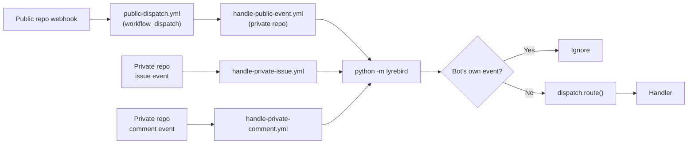

---

## Public Events

### Public Issue Opened

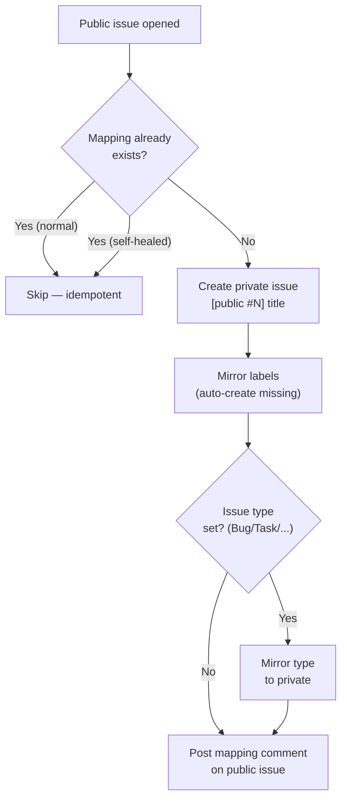

### Public Issue Edited

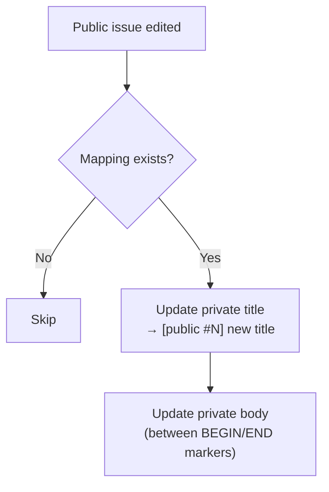

### Public Issue Closed

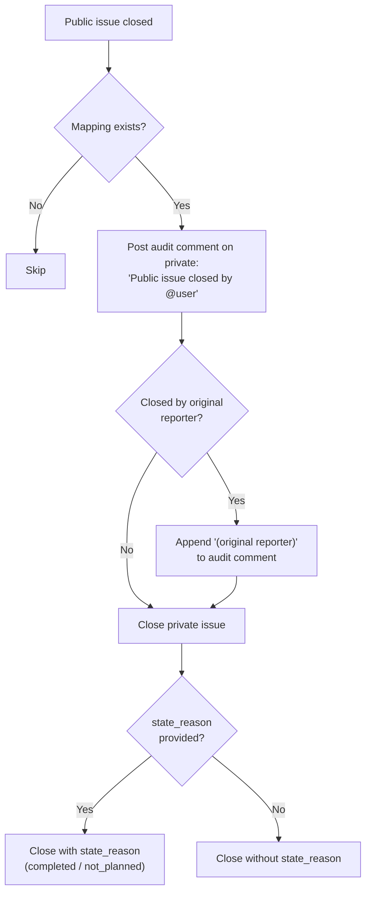

### Public Issue Reopened

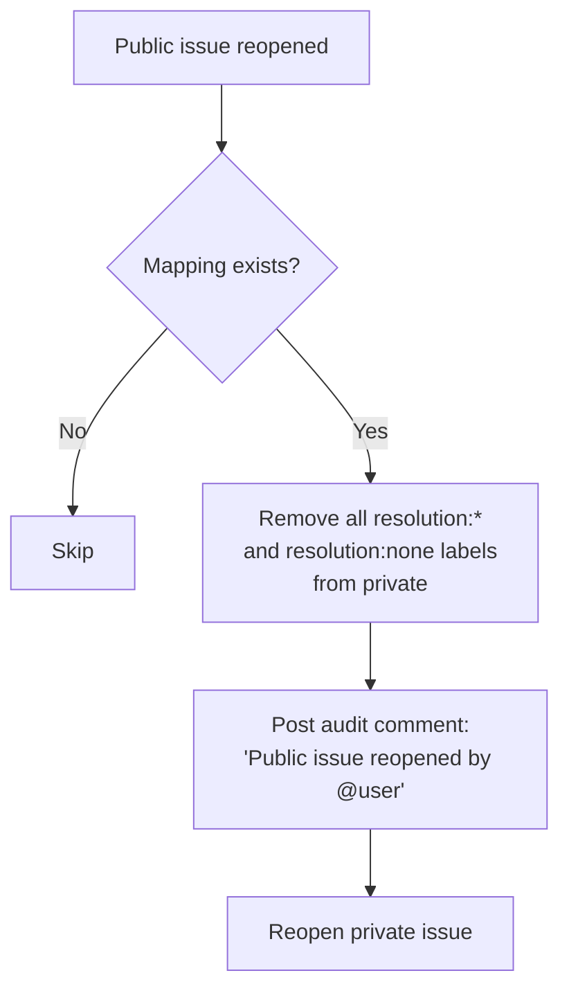

### Public Comment Created

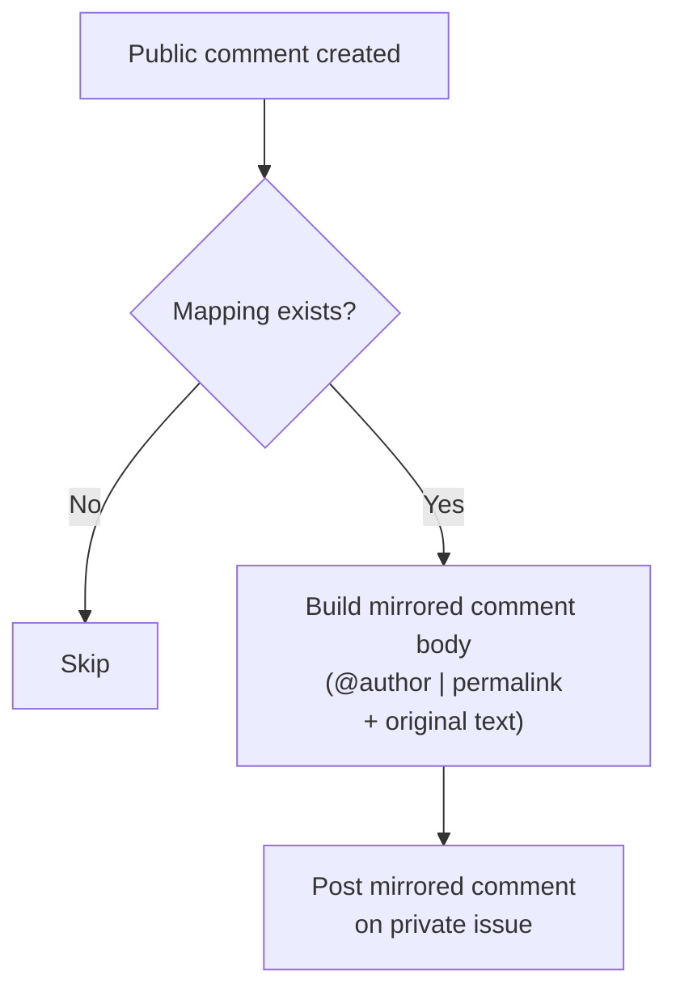

### Public Comment Edited

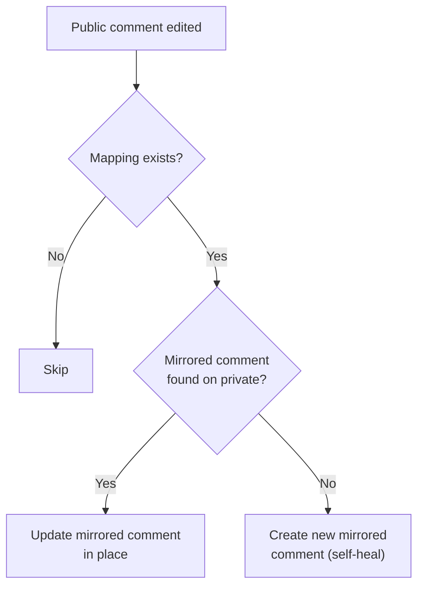

### Public Comment Deleted

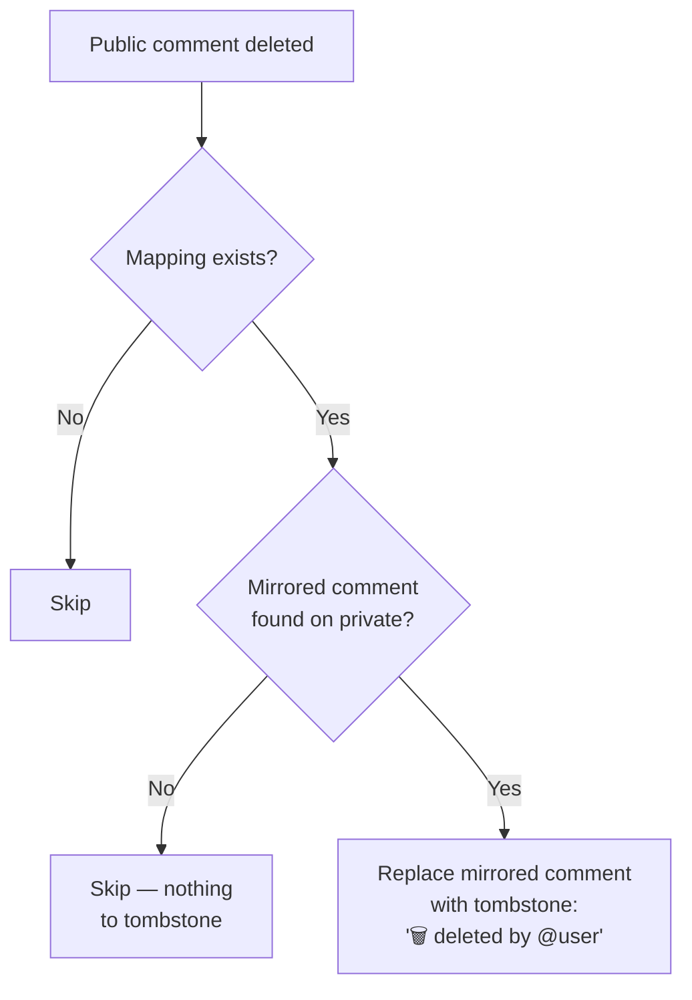

### Public Label Added/Removed

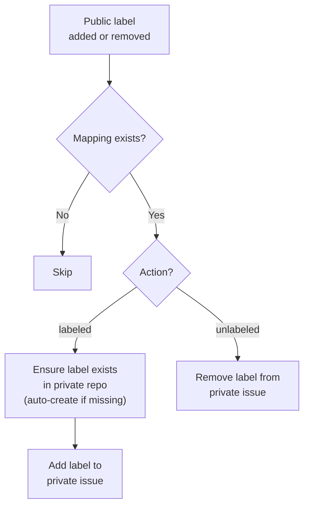

### Public Issue Typed/Untyped

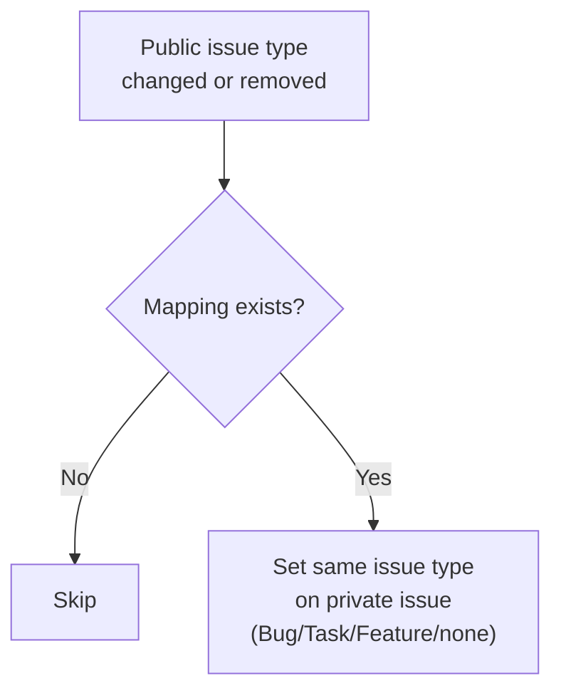

---

## Private Events

### Private Issue Closed

The public issue is **always closed immediately**. The resolution note is only posted if exactly one resolution label is present.

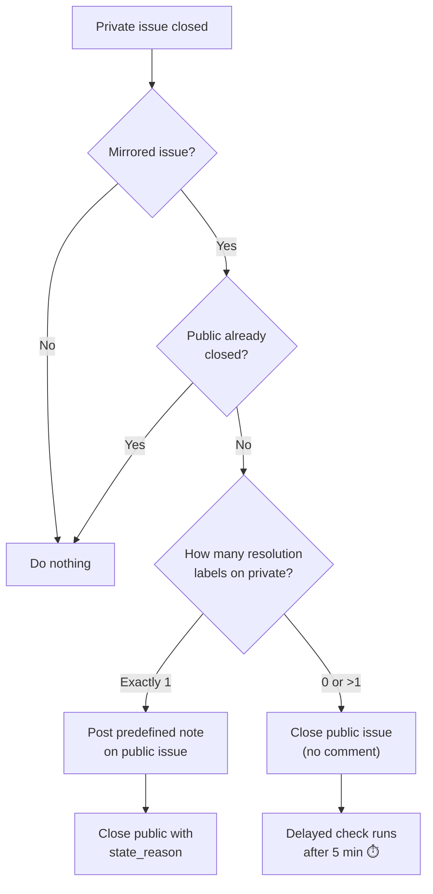

### Delayed Close Check (5 min after close)

A second workflow job runs after a 5-minute delay in the workflow. It re-checks the issue state and nudges if no resolution was provided.

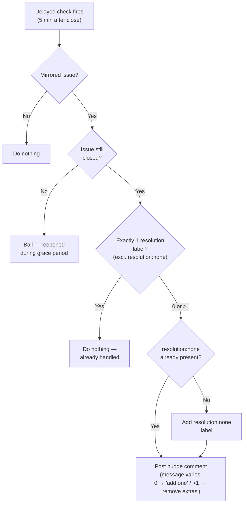

### Private Issue Reopened

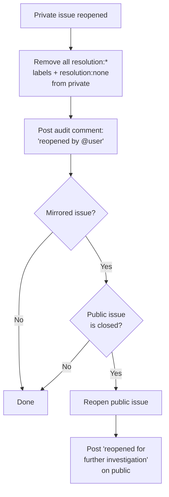

### Private Label Added/Removed

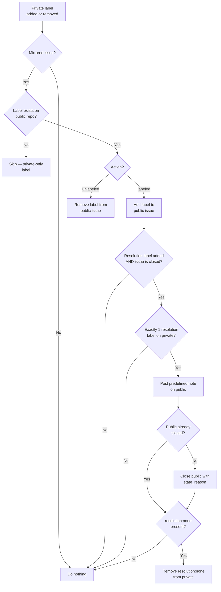

### Private Issue Typed/Untyped

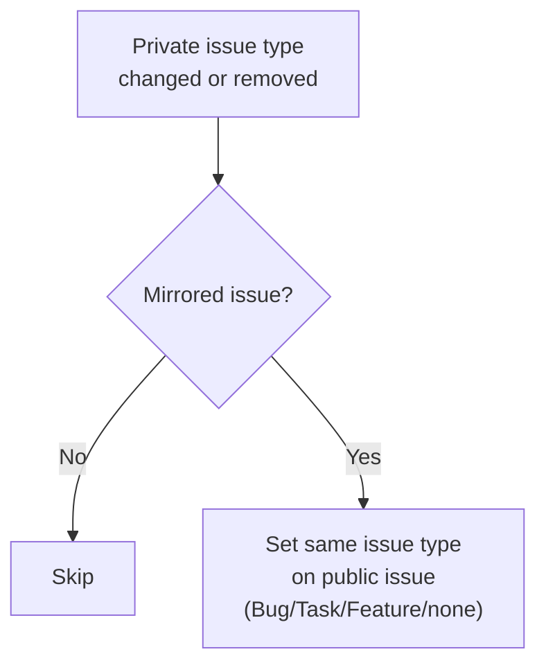

### `/anon` Slash Command

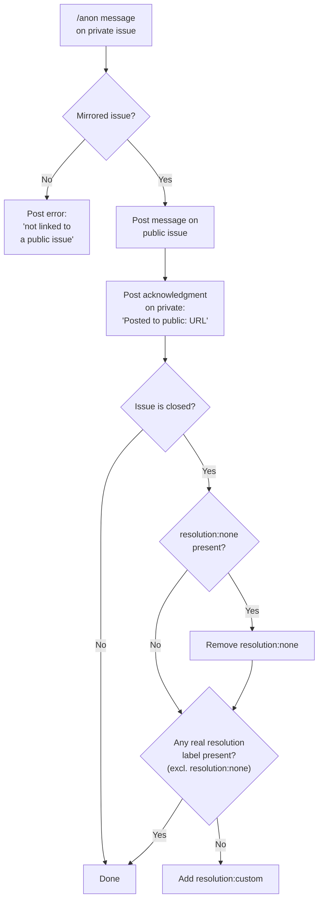

---

## Resolution Labels

| Label | Purpose |
|-------|---------|
| `resolution:completed` | Resolved as completed — posts fix note |
| `resolution:not-planned` | Resolved as not planned — posts decline note |
| `resolution:cannot-reproduce` | Cannot reproduce — asks for more info |
| `resolution:custom` | Custom message posted via `/anon` — no auto note |
| `resolution:none` | Nudge label — no resolution posted yet (added by delayed check) |

---

## Typical Scenarios

### Happy path: close with label
1. Maintainer adds `resolution:completed` on private issue
2. Maintainer closes private issue
3. Lyrebird posts "This has been fixed..." on public and closes it
4. Delayed check fires after 5 min, sees 1 label, does nothing

### Close first, label later (within 5 min)
1. Maintainer closes private issue (no resolution label)
2. Lyrebird closes public issue with no comment
3. Within 5 min, maintainer adds `resolution:not-planned`
4. Label handler posts note on public, removes `resolution:none` if present
5. Delayed check fires, sees 1 label, does nothing

### Close with `/anon` custom message
1. Maintainer closes private issue
2. Lyrebird closes public issue
3. Maintainer uses `/anon Thanks for the report!`
4. Lyrebird posts message on public, adds `resolution:custom` on private
5. Delayed check fires, sees `resolution:custom`, does nothing

### No action taken (nudge)
1. Maintainer closes private issue
2. Lyrebird closes public issue
3. 5 minutes pass with no action
4. Delayed check adds `resolution:none` and posts nudge on private
5. Maintainer can then add a label or use `/anon`
